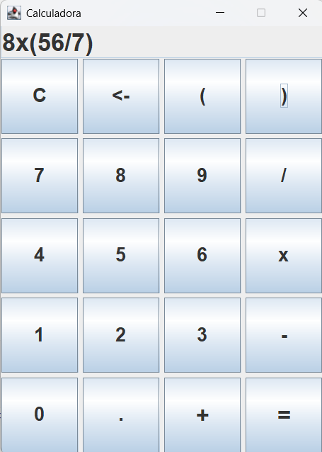

# Calculadora Swing Java

Calculadora desktop desenvolvida em **Java** utilizando **Swing**, com foco em praticar orientação a objetos, interface gráfica, tratamento de eventos e lógica para resolução de expressões matemáticas.

O projeto permite realizar operações básicas, trabalhar com expressões com mais de dois números, utilizar parênteses, números negativos e continuar cálculos a partir do resultado obtido.

## Sobre o projeto

Este projeto foi desenvolvido com o objetivo de reforçar conceitos fundamentais de Java por meio de uma aplicação visual e funcional.

A calculadora não se limita apenas a operações simples entre dois números. Ela permite montar expressões matemáticas pela interface gráfica, respeitando a ordem correta das operações, o uso de parênteses e a precedência matemática.

## Preview



## Funcionalidades

* Interface gráfica desenvolvida com Java Swing
* Botões numéricos de 0 a 9
* Operações de soma, subtração, multiplicação e divisão
* Suporte a expressões com múltiplos números
* Respeito à precedência matemática
* Suporte a parênteses
* Suporte a números negativos
* Botão para limpar a expressão
* Botão para apagar o último caractere
* Continuação de cálculo a partir do resultado
* Tratamento de erros em expressões inválidas

## Tecnologias utilizadas

* Java
* Java Swing
* Programação Orientada a Objetos

## Conceitos praticados

Durante o desenvolvimento deste projeto, foram praticados conceitos como:

* Encapsulamento
* Construtores
* Getters e setters
* Métodos públicos e privados
* Separação de responsabilidades
* Manipulação de Strings
* Estruturas condicionais
* Laços de repetição
* Tratamento de exceções
* Eventos com `ActionListener`
* Criação de interface gráfica com `JFrame`, `JPanel`, `JTextField` e `JButton`

## Estrutura do projeto

```txt
calculadora-swing-java/
│
├── assets/
│   └── calculadora-preview.png
│
├── src/
│   └── br/
│       └── com/
│           └── enzonukui/
│               └── calculadora/
│                   ├── Main.java
│                   ├── Calculadora.java
│                   └── CalculadoraTela.java
│
└── README.md
```

## Classes principais

### Main

Classe responsável por iniciar a aplicação.

Ela cria uma instância da classe `CalculadoraTela`, que exibe a interface gráfica da calculadora.

### Calculadora

Classe responsável pela lógica da calculadora.

Ela armazena a expressão matemática, calcula o resultado e contém os métodos responsáveis por validar e resolver as operações.

Principais responsabilidades:

* Armazenar a expressão atual
* Armazenar o resultado
* Adicionar números, operadores, ponto decimal e parênteses
* Apagar o último caractere
* Limpar a calculadora
* Resolver expressões matemáticas
* Tratar divisão por zero e expressões inválidas

### CalculadoraTela

Classe responsável pela interface gráfica.

Ela cria a janela, o display, os botões e os eventos de clique. Essa classe se comunica com a classe `Calculadora`, mas não realiza os cálculos diretamente.

Principais responsabilidades:

* Criar a janela da aplicação
* Criar o display da calculadora
* Criar os botões
* Capturar os cliques do usuário
* Atualizar o display
* Exibir o resultado ou mensagem de erro

## Como executar

1. Clone o repositório:

```bash
git clone https://github.com/EnzoNukui/calculadora-swing-java.git
```

2. Abra o projeto em uma IDE Java, como IntelliJ IDEA, Eclipse ou VS Code.

3. Execute a classe `Main.java`.

Caminho da classe principal:

```txt
src/br/com/enzonukui/calculadora/Main.java
```

## Exemplos de uso

A calculadora aceita expressões como:

```txt
10+5
10+5*2
(10+5)*2
100/(5+5)
10*(-2)
20/5*2
```

Resultados esperados:

```txt
10+5 = 15
10+5*2 = 20
(10+5)*2 = 30
100/(5+5) = 10
10*(-2) = -20
20/5*2 = 8
```

## Aprendizados

Este projeto foi importante para praticar a criação de uma aplicação Java com interface gráfica e aplicar conceitos de orientação a objetos de forma mais organizada.

Além da parte visual com Swing, o projeto também reforçou a importância de separar a regra de negócio da interface. A classe `Calculadora` ficou responsável pelos cálculos, enquanto a classe `CalculadoraTela` ficou responsável apenas pela interação com o usuário.


## Autor

Desenvolvido por **Enzo Nukui**.
